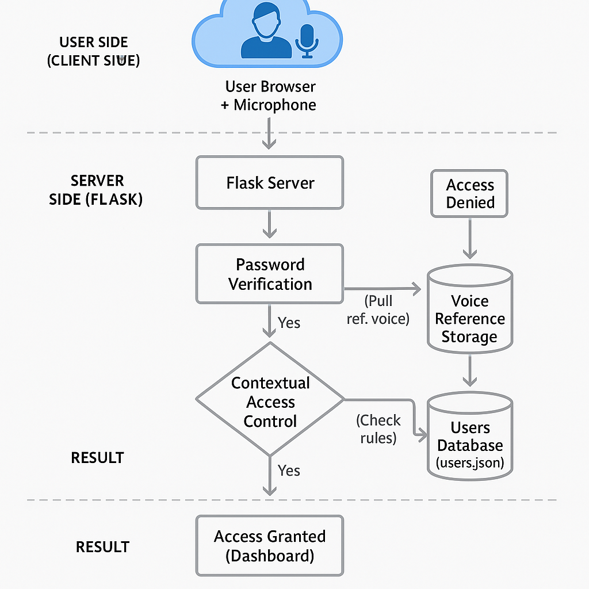
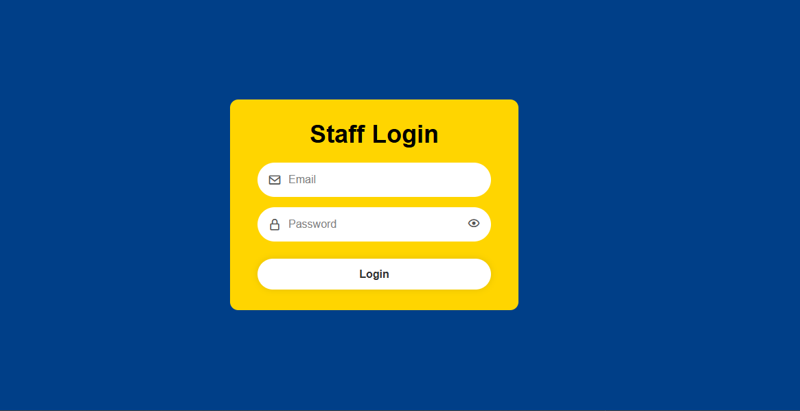
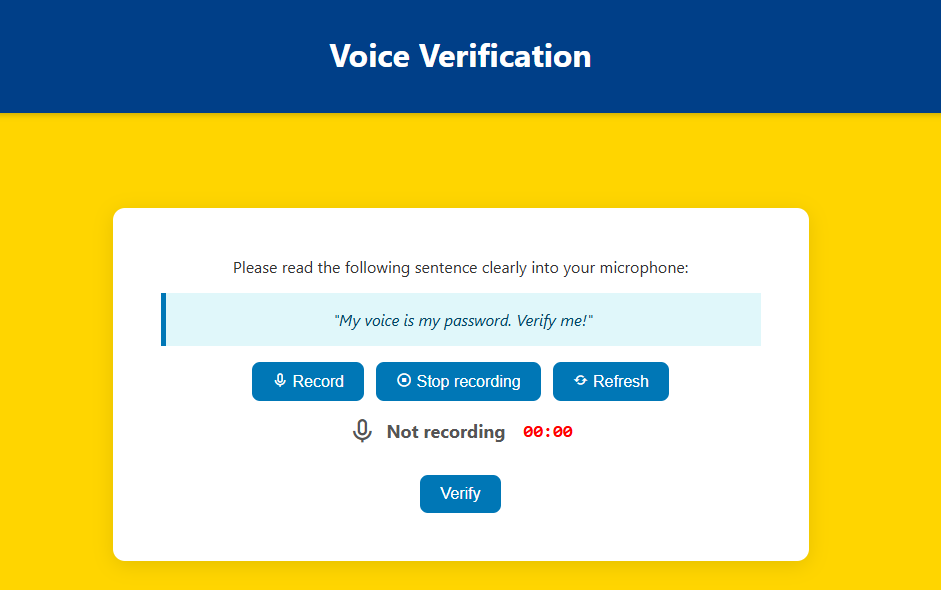
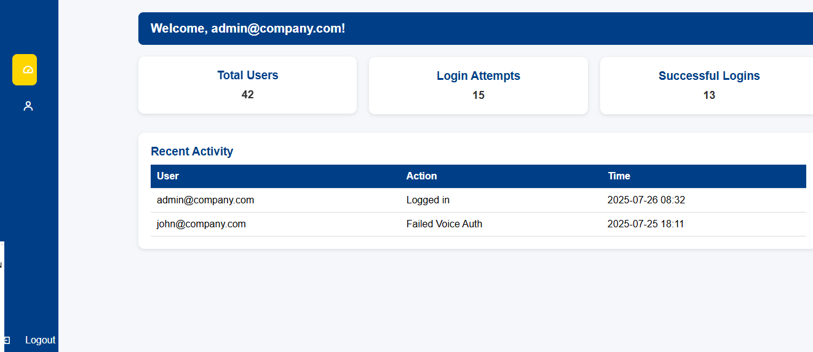
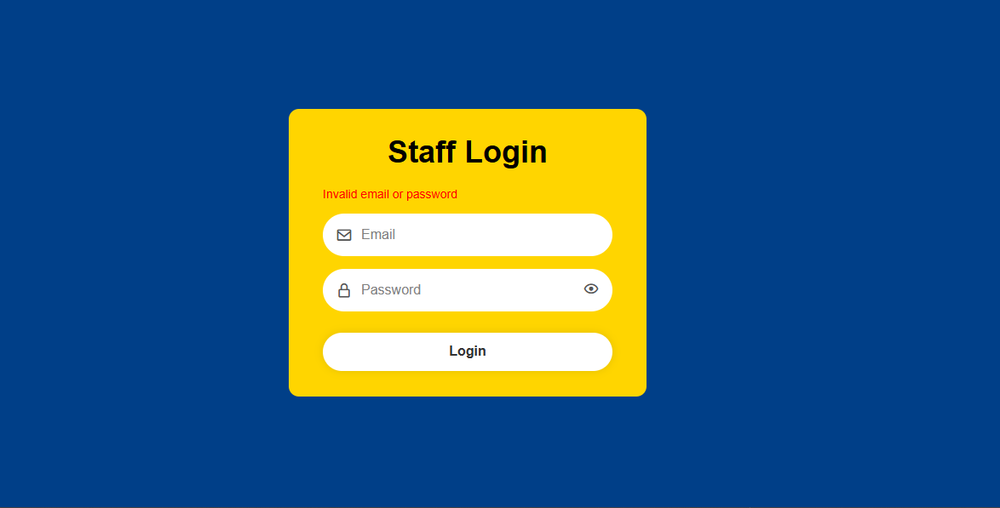
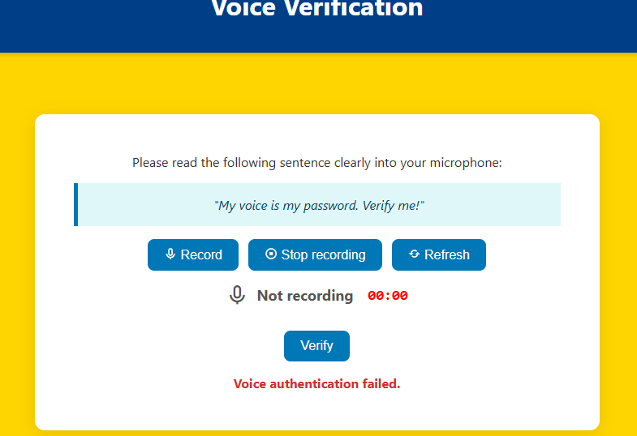
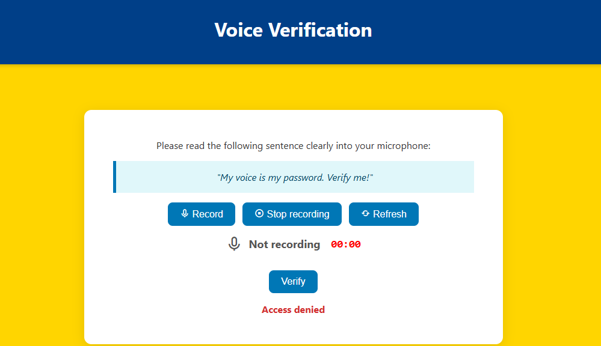

Zero Trust Authentication Gateway Using voice as a Biometric Factor.

* Overview.
## 🔐 Overview

This project implements a **Zero Trust Authentication Gateway** combining traditional credentials, voice biometrics, and contextual access controls to secure user logins. It demonstrates a multi-layered approach to identity verification in line with the *“never trust, always verify”* philosophy.

The system validates user identity through three independent factors:

1. **Credential Verification**  
   Users must enter a valid email and password combination.

2. **Voice Biometric Verification**  
   The user’s voice sample is recorded, cleaned, converted to Mel Frequency Cepstral Coefficients (MFCCs), and compared to a stored reference sample for similarity.

3. **Contextual Access Control**  
   Additional checks ensure the login attempt originates from an approved IP address and within permitted hours.

Only when **all three checks succeed** is access granted.

It is built as a web-based prototype using **Python Flask** and key signal processing libraries.

🧠 System Architecture

The system follows a modular Zero Trust design, where:

- The **frontend** captures user credentials and voice input.
- The **Flask backend** verifies credentials and routes logic.
- The **voice module** performs MFCC extraction and similarity scoring.
- The **contextual module** validates IP and login time.
- Final access is granted or denied based on all three independent checks.

---
* Requirements.
Python 3.9+
pip(Python package manager)
Recommended OS :Windows 10/linux/macOS
Python libraries:flask
                librosa
                numpy
                scikit-learn
                sounddevice
                noisereduce
                pyaudio

* Installation
1.Clone or Download the project folder.
2.Open a terminal in the project directly.
3.Create a virtual environment (recommended):
python -m venv venv

4.Activate the environment.
Windows:venv\Scripts\activate
macOS/Linux:source venv/bin/activate

5.Install dependencies:pip install -r requirements.txt

* Running the project.
1.In the terminal(with environment active) run:python app.py
2.Open your browser and go to :http://127.0.0.1:5000

* Usage
1.Login: 
        Enter email and password.
        Record your voice when prompted.

2.System checks:
                Voice match(MFCC + similarity score)
                IP address verification
                Time of access restictions

3.Access granted or denied based on Zero Trust rules.

* Testing
Test the system under :
                        # Normal conditions - correct password & correct voice
                        # Noist environment - Background noise presant.
                        #Spoof attempt - Recorded voice instead of live speech.

*Toubleshoting:
               # Microphane not detected - Check system audio settings.
               #No voice match - Re-enroll your voice sample in quiet conditions.
               #Port already in use - Change Flask port in app.py

*Security Notes:
                #Store voice samples securely.
                #Do not expose the Flask app directly to the internet without proper HTTPs.
                #Periodically retain or refresh enrolled voice data.
                
* ⚠️ Notes

- Voice samples are not included for privacy/security.
- Accuracy may vary depending on background noise and recording quality.
- Designed for demonstration and academic purposes only.

 🖥️ User Interface Preview

 🔐 Login Page

Voice authentication page

✅ Successful Login

 🚫 Blocked Attempt ( Invalid login credentials,Voice verification failed and Contextual Check Failed)

 
                

License :This project is for academic purposes only and is not production-ready.
© 2025 Thiranja Aththanayake.